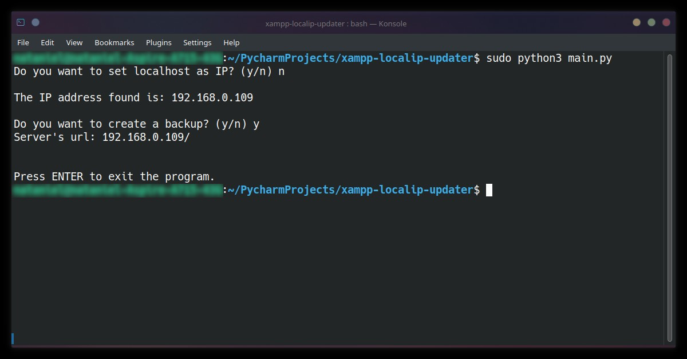

# XAMPP IP Updater

Primitive terminal based program that automates the process of setting up local IP instead of Localhost in Apache's
httpd.conf file.



## Requirements

You need to have installed `PyYaml` module. You can download it using this command:
`pip install pyyaml`

## Usage

1. **Windows**: It’s recommended to run the program from the terminal. First, open cmd then change the current directory
to where the `main.py` file is located (alternatively, open the directory immediately in the terminal
from the explorer level). Then use the `py main.py` command.  

2. **Linux**: Make sure that you’ve installed *net-tools*, which provides the `ifconfig` command. Open the directory
where `main.py` is located and use the following command `sudo python3 main.py`
(you can skip the `sudo` if you’ve changed the owner and permissions of the httpd.conf file).

3. **macOS**: There’s no support for macOS.

In either case the program always creates a backup of the previous version of the `httpd.conf` file
(if you do not wish to create backup, set `create_backup` to `False` in **settings.yaml**).

## Configuration

The program uses a YAML configuration file (`settings.yaml`) with the following settings:
```yaml
settings:
  # If create_backup is false, it overwrites ask_for_backup
  create_backup: Yes
  ask_for_backup: No
  return_server_url: No
```
- `create_backup`: If set to `Yes`, the program will create a backup of the `httpd.conf` file before making changes.
- `ask_for_backup`: If set to `Yes`, the program will ask the user whether to create a backup or not.
- `return_server_url`: If set to `Yes`, the program will return the server’s URL after updating the IP.

> NOTE: Even if the YAML configuration file is not found by the program, the code itself contains the default settings.

## Features

- **Adapts to the OS**: The program can adapt to the user’s operating system (Windows or Linux)
and execute the appropriate commands to get the local IP and update the `httpd.conf` file accordingly.

- **Backup Creation**: The program can create a backup of the `httpd.conf` file before making changes.
This feature can be controlled using the `create_backup` and `ask_for_backup` settings in the `settings.yaml` file.

- **Local IP Detection**: The program can detect the local IP of the machine and update the `httpd.conf` file to use
this IP instead of localhost.

- **Server URL Display**: If the `return_server_url` setting in `settings.yaml` is set to `Yes`,
the program will display the server’s URL after updating the IP.
